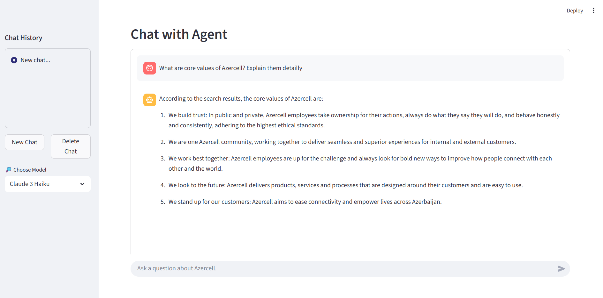

# Azercell Knowledge Base Chatbot

A containerized chatbot application that provides intelligent responses using AWS Bedrock and Azercell's knowledge base.

## 🖥️ Interface


## 🚀 Quick Start

### Prerequisites

- [Docker ≥ 24](https://docs.docker.com/) & Docker Compose
- AWS credentials for Bedrock access

### Setup

1. **Clone the repository**
   ```bash
   git clone https://github.com/HuGoBass09/DataMinds_Homework_7.git
   cd bedrock-chat-bot
   ```

2. **Configure environment**
   - Create `backend/.env` file
   - Add your AWS credentials:
     ```
     ACCESS_KEY="your_aws_access_key"
     SECRET_KEY="your_aws_secret_key"
     ```

3. **Run the application**
   ```bash
   docker compose up --build
   ```

### Access Points

| Service | URL | Port | EC2 URL |
|---------|-----|------|-------------------|
| Streamlit Frontend | http://localhost:8501 | 8501 | [http://34.233.30.9:8501](http://34.233.30.9:8501) |
| FastAPI Backend | http://localhost:8000 | 8000 | [http://34.233.30.9:8000](http://34.233.30.9:8000) |
| API Documentation | http://localhost:8000/docs | 8000 | [http://34.233.30.9:8000/docs](http://34.233.30.9:8000/docs) |

## ⚙️ Configuration

Available AI models are configured in `frontend/config.py`:

```python
MODEL_OPTIONS = {
    "Claude 3 Haiku": "anthropic.claude-3-haiku-20240307-v1:0",
    "Claude 3.5 Sonnet": "anthropic.claude-3-5-sonnet-20240620-v1:0",
}
```

## 🏗️ Architecture

- **Frontend**: Streamlit application with chat interface
- **Backend**: FastAPI server handling AWS Bedrock integration
- **Knowledge Base**: AWS Bedrock knowledge base with Azercell data

## 📦 Project Structure

```
bedrock-chat-bot/
├── frontend/           # Streamlit web application
├── backend/            # FastAPI server
├── docker-compose.yml  # Container orchestration
└── README.md          # Project documentation
```

## 🚀 Production Deployment

For EC2 deployment:

1. Add user to docker group:
   ```bash
   sudo usermod -aG docker ubuntu
   ```

2. Setup GitHub self-hosted runner for CI/CD
3. Configure environment variables
4. Deploy using the CI/CD pipeline

## 🙏 Acknowledgements

- [MCP Playground](https://github.com/Elkhn/mcp-playground)  
